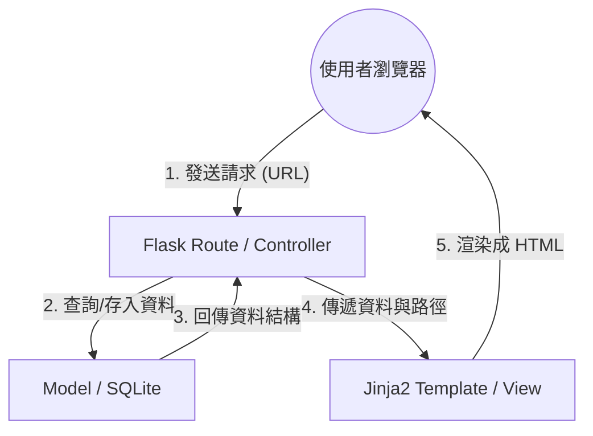

# 讀書筆記本 (Reading Notebook) 系統架構文件

## 1. 技術架構說明

本專案採用經典的 **MVC (Model-View-Controller)** 架構模式，並結合 Flask 框架的特性來實現。

- **技術選型**：
  - **後端 (Controller/Logic)**：Python + Flask。負責接收使用者請求、處理商業邏輯（如：計算書籍排行、過濾搜尋結果），並與資料庫互動。
  - **資料庫 (Model)**：SQLite。輕量級的關聯式資料庫，適合個人讀書筆記這種資料量適中的應用，無需額外架設資料庫伺服器。
  - **模板引擎 (View)**：Jinja2。直接與 Flask 整合，負責將後端的資料動態渲染成 HTML 頁面呈現給使用者。

- **MVC 職責分配**：
  - **Model (模型)**：定義書籍 (Book) 與心得 (Note) 的資料結構，處理與 SQLite 的 CRUD (增刪改查) 動作。
  - **View (視圖)**：Jinja2 模板（`.html` 檔案），定義網頁的外觀與資料顯示方式。
  - **Controller (控制器)**：Flask 路由 (Routes)，連結 Model 與 View。根據 URL 導向對應的邏輯處理，並決定渲染哪個頁面。

---

## 2. 專案資料夾結構

```text
reading_notebook/
├── app/
│   ├── __init__.py       # 初始化 Flask App 與配置
│   ├── models/           # 資料庫模型定義
│   │   └── book.py       # 書籍與心得的資料結構
│   ├── routes/           # 路由定義 (Controller)
│   │   ├── main.py       # 首頁與搜尋邏輯
│   │   └── books.py      # 書籍新增、修改、刪除邏輯
│   ├── static/           # 靜態資源 (前端)
│   │   ├── css/          # 樣式表 (設計感設計)
│   │   └── js/           # 前端互動邏輯
│   └── templates/        # Jinja2 模板 (View)
│       ├── base.html     # 共用版型 (Navbar, Footer)
│       ├── index.html    # 首頁 (顯示清單與排行)
│       ├── add.html      # 新增書籍頁面
│       ├── detail.html   # 書籍詳情與心得頁面
│       └── search.html   # 搜尋結果頁面
├── docs/                 # 專案文件 (PRD, Architecture 等)
├── instance/             # 私有設定與資料庫檔案
│   └── database.db       # SQLite 資料庫主檔
├── tests/                # 測試腳本
├── app.py                # 專案入口點 (啟動 Flask)
├── requirements.txt      # 專案套件依賴清單
└── README.md             # 專案讀我檔案
```

---

## 3. 元件關係圖

以下展示了資料流與元件互動的路徑：



---

## 4. 關鍵設計決策

1. **整合式開發 (Monolithic)**：
   - **選擇**：不採用前後端分離，而是使用 Flask + Jinja2 直接渲染。
   - **原因**：對於個人筆記工具，這種做法開發效率最高，且能充分利用 Jinja2 的模板繼承 (Template Inheritance) 功能減少重複程式碼。

2. **SQLite 資料庫**：
   - **選擇**：使用 SQLite 並存放在 `instance/` 資料夾。
   - **原因**：SQLite 是單一檔案，部署與攜帶極其方便。放在 `instance/` 是 Flask 的最佳實踐，能將程式碼與實際資料分離。

3. **路由模組化 (Blueprints)**：
   - **選擇**：將路由拆分到 `app/routes/` 下的多個檔案。
   - **原因**：雖然目前功能簡單，但模組化能讓未來擴展（如：增加使用者系統、社群功能）時更加清晰，不會讓 `app.py` 變得過於肥大。

4. **採用 Tailwind-like 自定義 CSS**：
   - **選擇**：在 `static/css/` 中建立一套精美的 UI 系統。
   - **原因**：為了符合 PRD 中「讓愛書人驚艷」的視覺需求，我們將在 CSS 中加入平滑過渡 (Transitions) 與柔和的色彩計畫。

---
