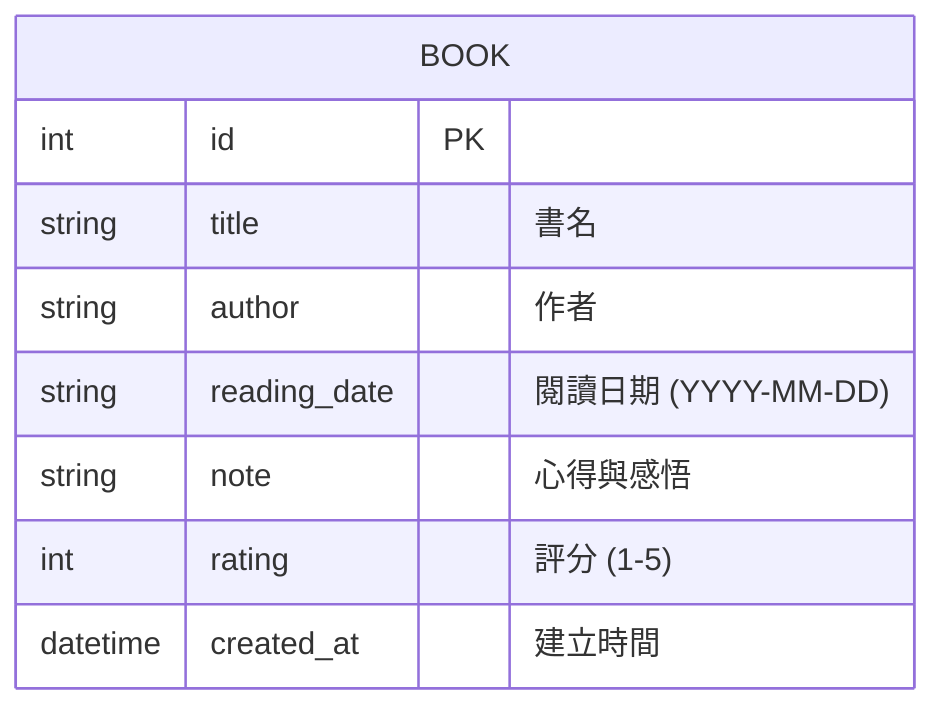

# 讀書筆記本 (Reading Notebook) 資料庫設計文件

## 1. ER 圖 (實體關係圖)



## 2. 資料表詳細說明

### BOOK 資料表

| 欄位名稱 | 型別 | 說明 | 必填 | 備註 |
| :--- | :--- | :--- | :--- | :--- |
| id | INTEGER | 流水號 | 是 | PRIMARY KEY AUTOINCREMENT |
| title | TEXT | 書名 | 是 | |
| author | TEXT | 作者 | 是 | |
| reading_date | TEXT | 閱讀日期 | 否 | 格式：YYYY-MM-DD |
| note | TEXT | 心得與感悟 | 否 | |
| rating | INTEGER | 評分 | 是 | 範圍 1-5 |
| created_at | DATETIME | 建立時間 | 是 | 預設為 CURRENT_TIMESTAMP |

---

## 3. SQL 建表語法

完整語法儲存在 [database/schema.sql](file:///c:/Users/User/Desktop/1/web_app_development/database/schema.sql)。

```sql
CREATE TABLE IF NOT EXISTS books (
    id INTEGER PRIMARY KEY AUTOINCREMENT,
    title TEXT NOT NULL,
    author TEXT NOT NULL,
    reading_date TEXT,
    note TEXT,
    rating INTEGER NOT NULL CHECK (rating >= 1 AND rating <= 5),
    created_at DATETIME DEFAULT CURRENT_TIMESTAMP
);
```

---

## 4. Python Model 程式碼

本專案使用 `sqlite3` 直接操作資料庫。Model 實作於 `app/models/book.py`，包含 CRUD 方法。

詳見 [book.py](file:///c:/Users/User/Desktop/1/web_app_development/app/models/book.py)。
