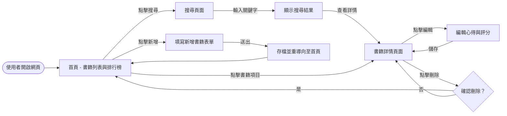
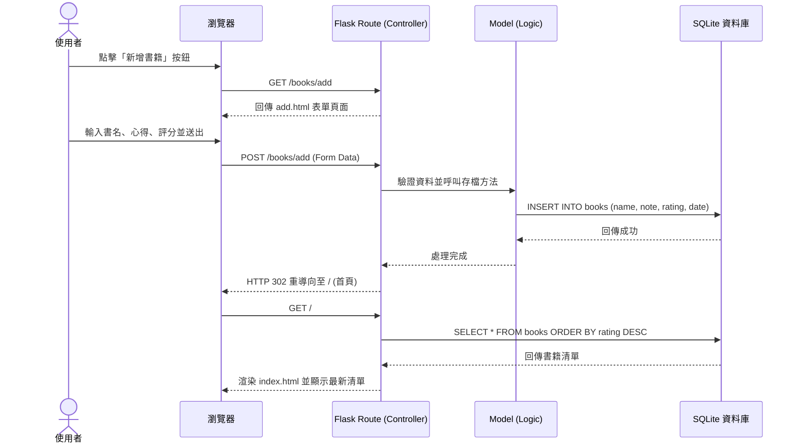

# 讀書筆記本 (Reading Notebook) 流程圖文件

## 1. 使用者流程圖 (User Flow)

描述使用者在「讀書筆記本」系統中的操作路徑，從進入首頁到完成各項功能的過程。

---

## 2. 系統序列圖 (Sequence Diagram)

以「新增一筆讀書筆記」為例，展示資料在各元件間的流動過程。

---

## 3. 功能清單與路由對照表 (Function-URL Mapping)

以下為系統預計實作的路由規劃：

| 功能描述 | URL 路徑 | HTTP 方法 | 對應頁面 |
| :--- | :--- | :--- | :--- |
| 首頁 (書籍列表與排行) | `/` | `GET` | `index.html` |
| 搜尋書籍 | `/search` | `GET` | `search.html` |
| 顯示新增表單 | `/books/add` | `GET` | `add.html` |
| 執行新增動作 | `/books/add` | `POST` | (重導向) |
| 查看書籍詳情 | `/books/<id>` | `GET` | `detail.html` |
| 顯示編輯表單 | `/books/<id>/edit` | `GET` | `edit.html` |
| 執行編輯動作 | `/books/<id>/edit` | `POST` | (重導向) |
| 執行刪除動作 | `/books/<id>/delete`| `POST` | (重導向) |

---

## 4. 流程說明

- **首頁核心**：首頁是系統的中樞，使用者可以一眼看到目前的閱讀清單與根據評分排名的「高分推薦」。
- **搜尋機制**：透過 `GET` 方法傳遞搜尋參數，方便使用者在瀏覽器紀錄中回溯搜尋結果。
- **資料安全**：在執行「刪除」動作時，序列圖中未詳盡展示的「確認視窗」將在前端實作，以防誤刪。
- **重導向設計**：所有的 `POST` 動作（新增、修改、刪除）完成後都會進行重導向 (Redirect)，避免使用者重新整理頁面時重複送出表單。
